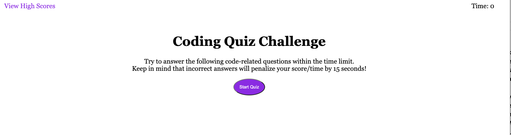
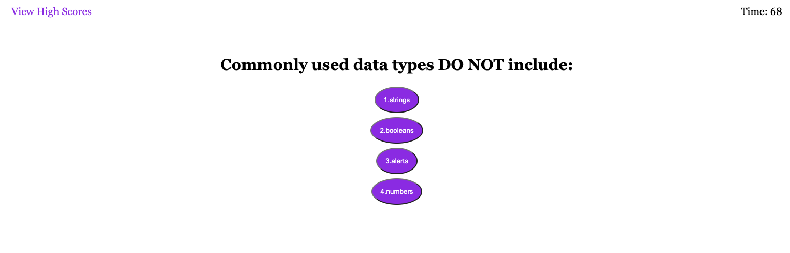

# Web-APIs-Code-Quiz
Bootcamp Challenge 4

## Your Task

My task was to build an application using mainly Javascript along with HTML and CSS.

As you click the start quiz button, Javascript will run to provide the questions that alters the HTML. The application will store your right and wrong answers in the local storage. Finally, it will sort the high scores of the quiz, which can be cleared to provide a clean slate.

## Preview

Here is a preview of the deployed application.

## Links

https://github.com/ndifiori/Web-APIs-Code-Quiz

https://ndifiori.github.io/Web-APIs-Code-Quiz/index.html

